# CNN Architecture

## Digit Recognition

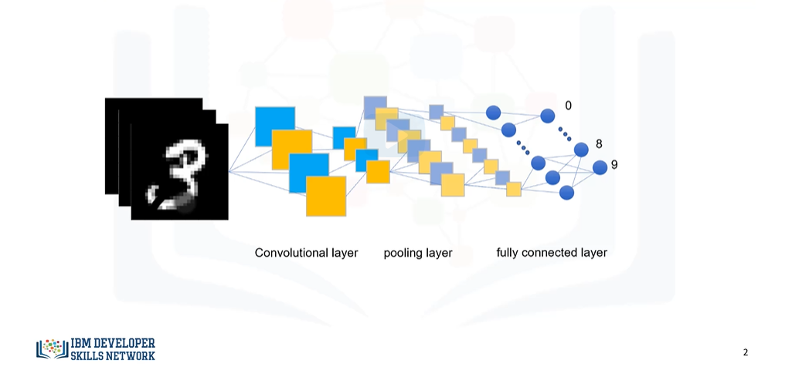

## Understanding Convolution

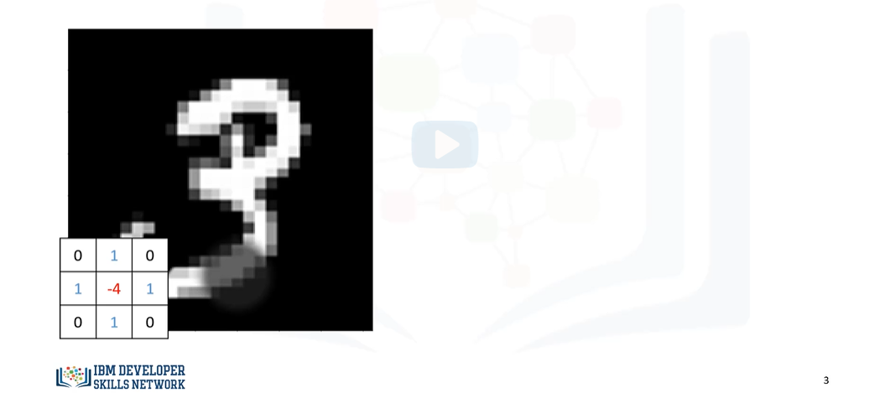

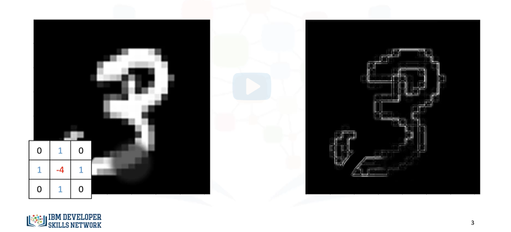

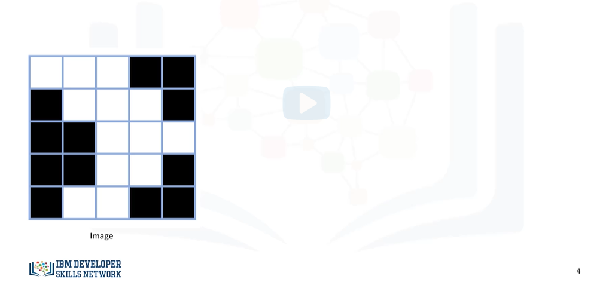

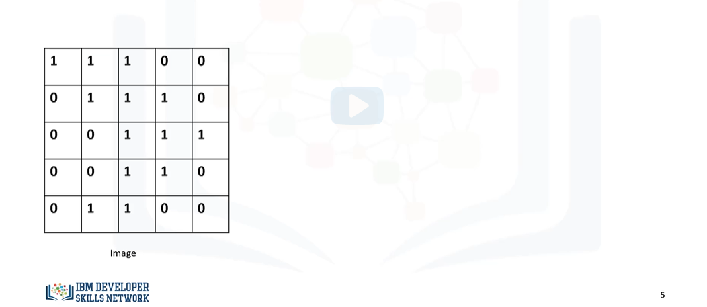

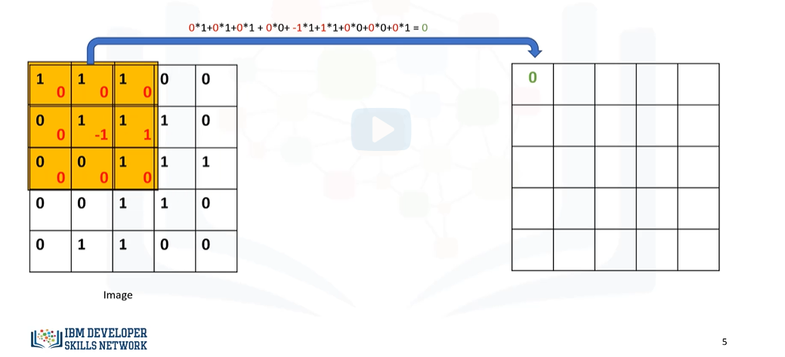

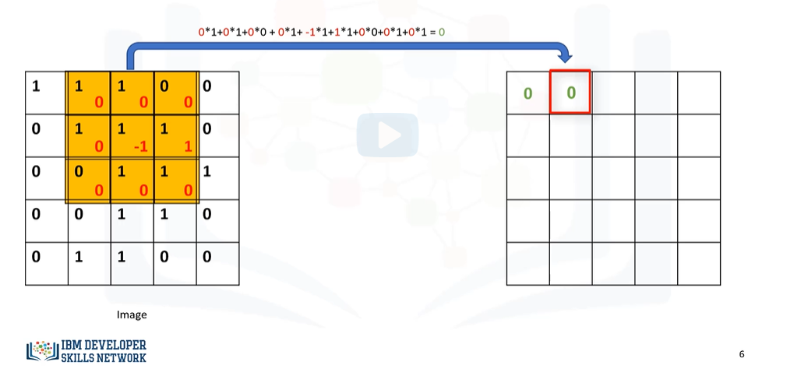

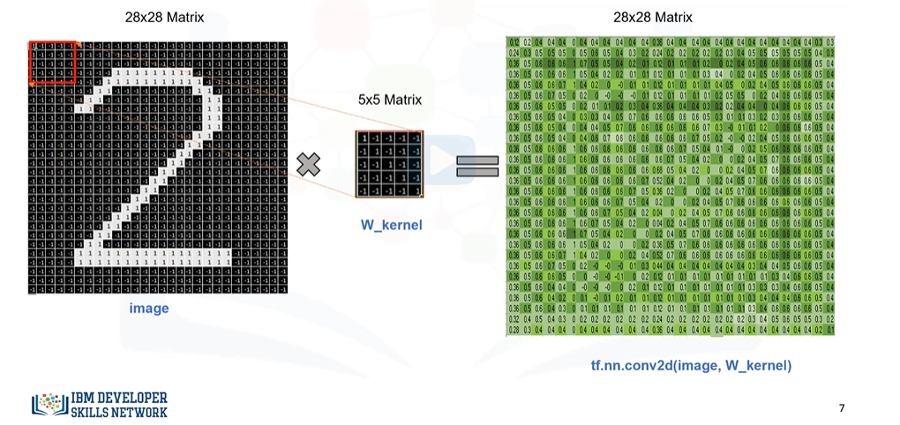

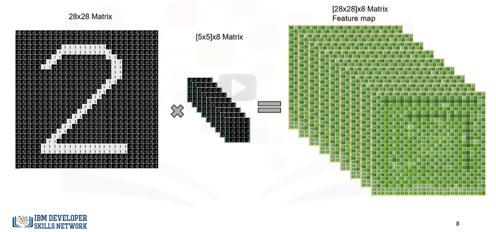

## Convolution Layer

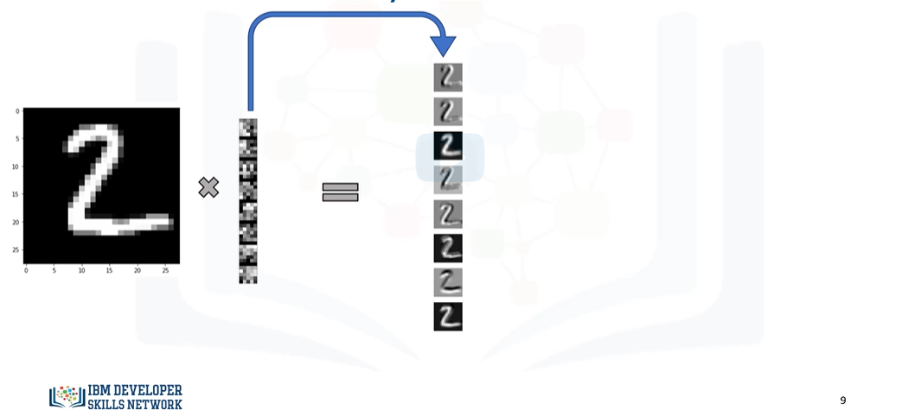

## CNN Architectures

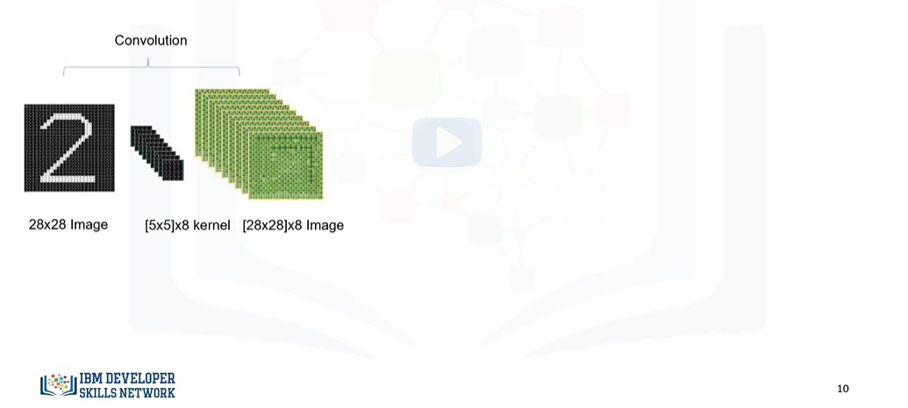

## Fonction d'Activation

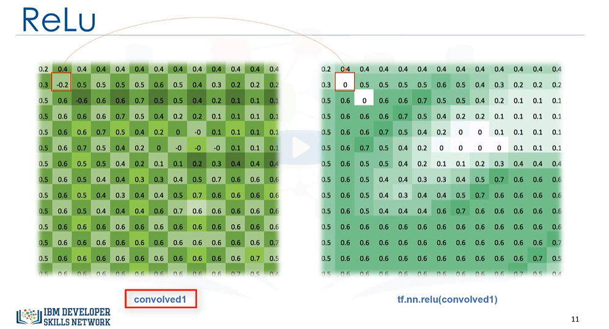

## CNN Architecture - ReLu

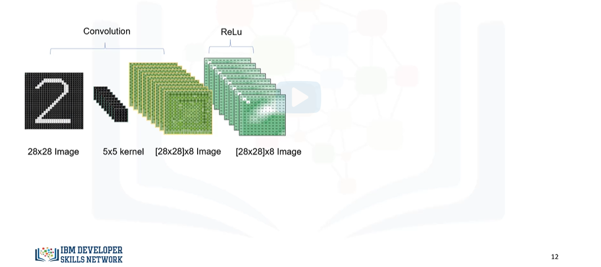
## Max Pooling

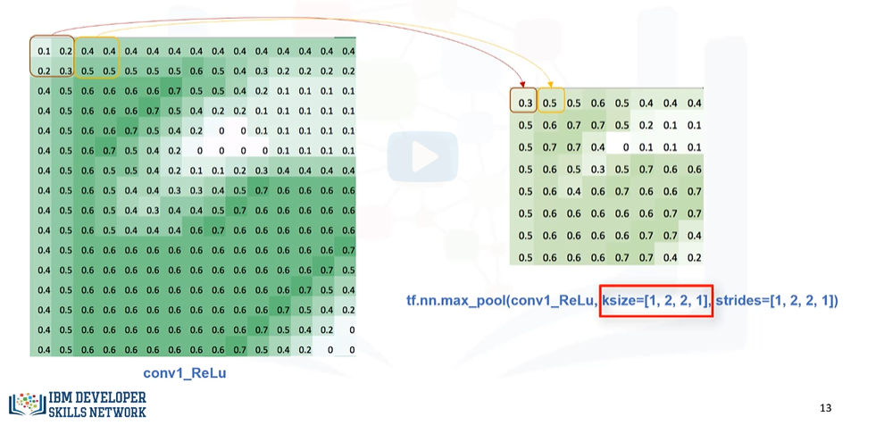

## CNN Architecture - ReLu - Max Pooling

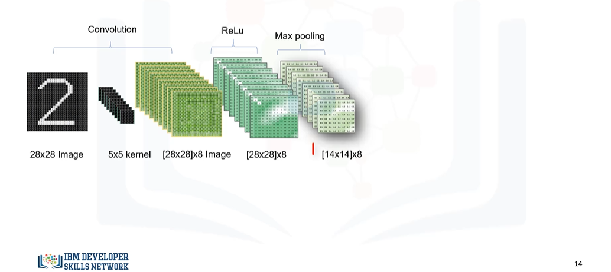

## Fully Connected Layer

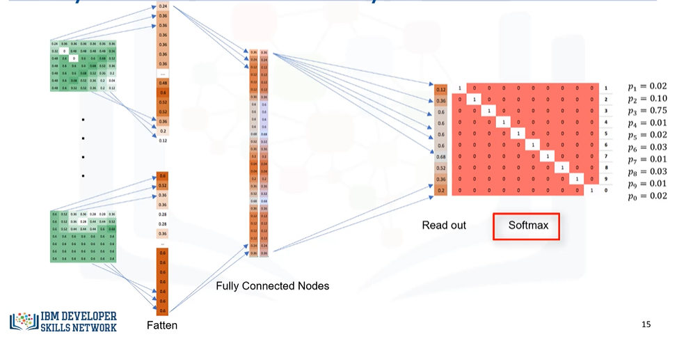