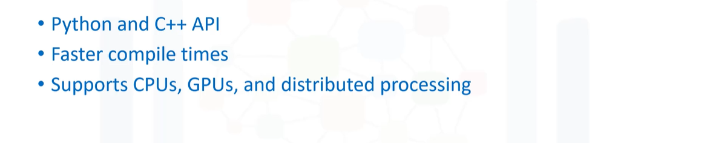
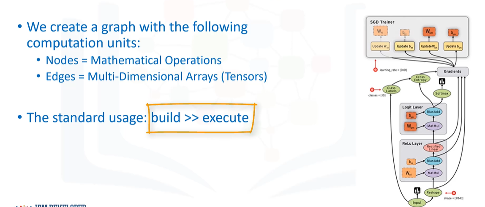
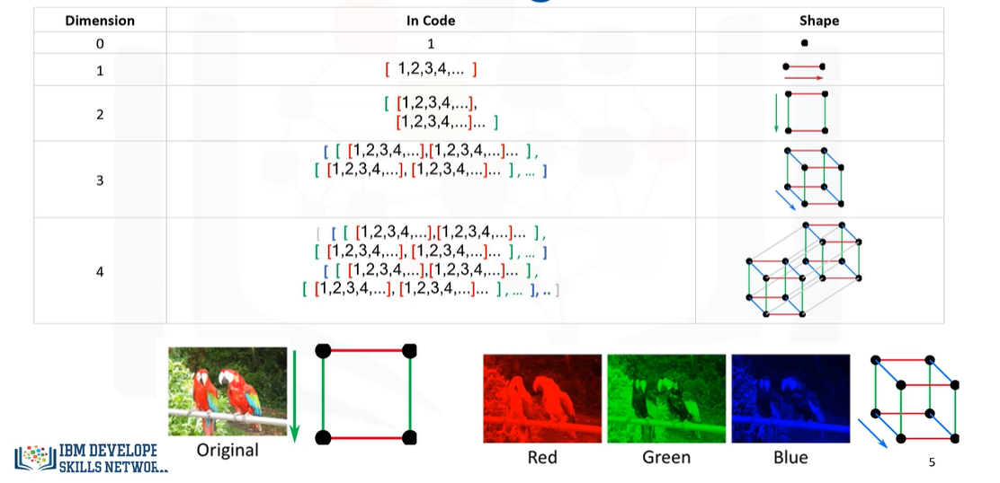
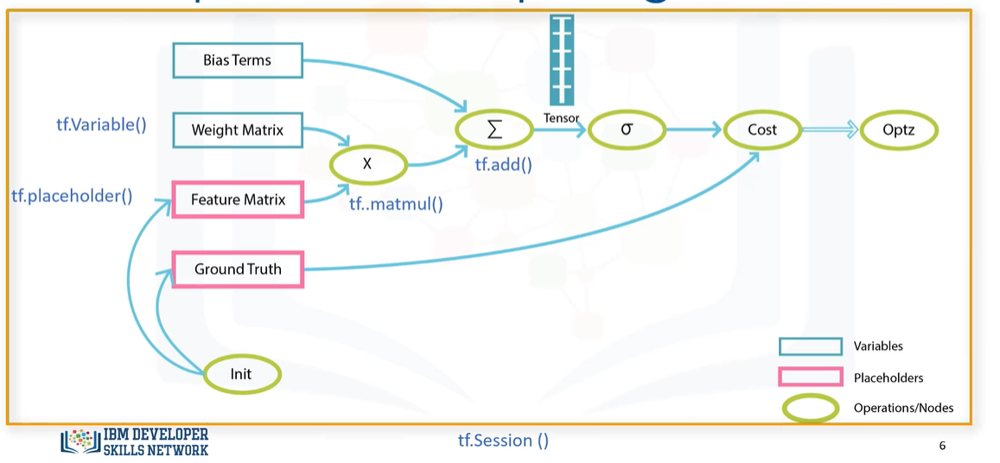
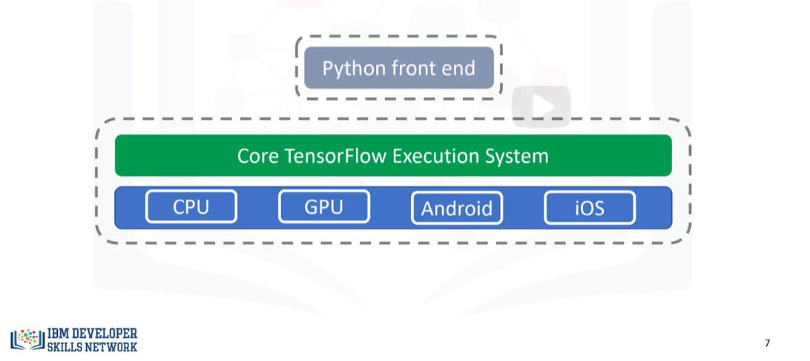
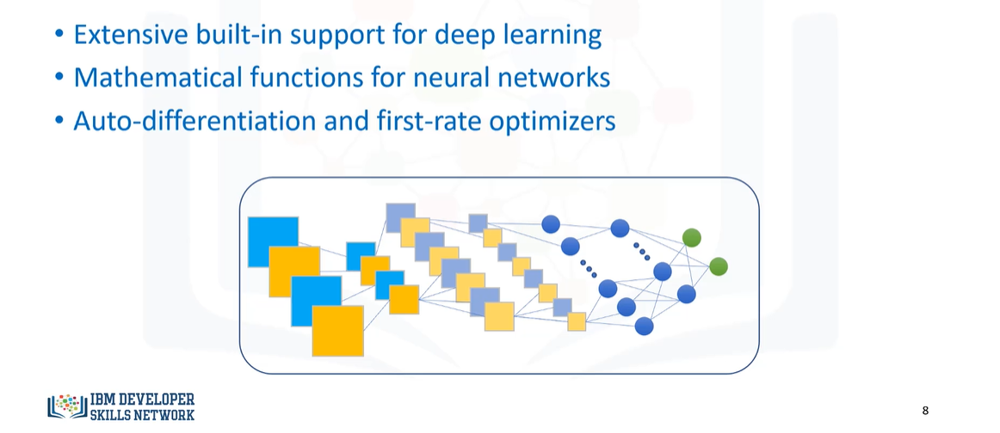

# Leçon 1: Tensorflow

## What is Tensorfow ?

## Why Tensorflow ?

## What is a data flow graph ?

## What is the meaning of Tensor ?

## Computation Graph ingredients

## Architecture of Tensorflow

## Why Deep Learning With Tensorflow ?

